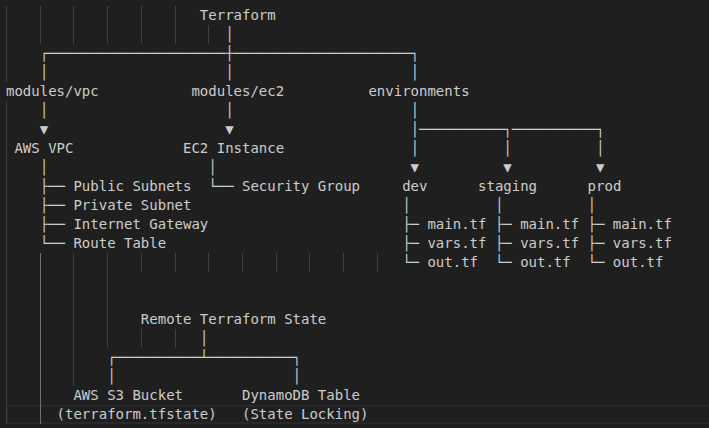
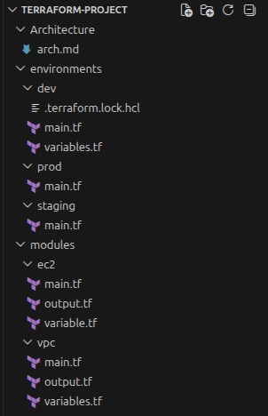

# terraform-aws-multi-env-infra
Production-grade Terraform infrastructure on AWS with modular architecture, remote state management using S3, and state locking using DynamoDB.

## Architecture Overview
- Modular Terraform structure (VPC & EC2)
- Custom AWS VPC with public & private subnets
- EC2 instance provisioning with security groups
- Remote backend using S3
- State locking using DynamoDB

## Architecture Diagram


## Tech Stack

- Terraform
- AWS (VPC, EC2, S3, DynamoDB)
- Infrastructure as Code (IaC)

## Project Structure


## Setup & Usage

### Clone the repository


## Setup & Usage

```bash
### Clone the repository

    git clone < https://github.com/iamshubham2001/terraform-aws-multi-env-infra >
    cd Terraform-project/environments/dev

### Initialize Terraform
    terraform init
### Validate configuration
    terraform validate
### Preview changes
    terraform plan
### Apply configuration
    terraform apply -auto-approve

```

## Remote State Management

- S3 is used to store Terraform state remotely
- DynamoDB is used for state locking to prevent concurrent modifications

## Key Learnings

- Modular Terraform design for scalability
- Remote state handling in team environments
- Debugging real-world issues (AMI, backend, locking)
- AWS networking basics (VPC, subnets, routing)
